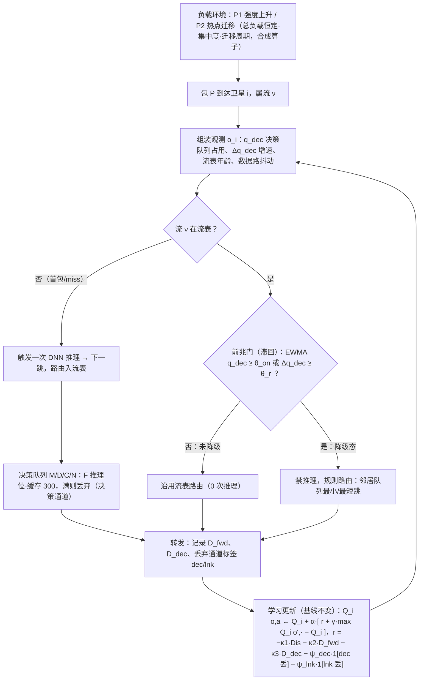

# 深化稿 — run2-A3（吸收 run2-B2）塌陷先发生在决策器：推理排队瓶颈、前兆与热点迁移

> **地位声明（稿首，必读）**：本卡是**候选线索，尚未裁决**。本稿只做深化（辨因、机制具体化、验证设计、反证边界），不构成任何"新颖性通过"或"立项成立"的结论。
>
> **已读范围声明**：深化过程中曾获准读取 run2 历史审查全文与 run2 九卡结构化字段，该授权随后被主控**收回**；本稿已剔除对该两项材料的全部引用，历史对象（谱系 D 卡11、同批 B2）仅按**主控摘录与本卡反馈单**的条目引用。本稿其余域内证据全部由本代理经 ssh 回 MinerU 全文 MD 逐条核验（核验篇章清单见 §2）。

## 0. must-address 逐条回应

### #1 承重锚 S85KQ4FC（21k pps / 17.5 ms / 21% 丢包）回 MinerU MD 核验 —— **通过，不降级**

- **位置**：S85KQ4FC（*Enabling High-Throughput Routing for LEO Satellite Broadband Networks: A Flow-Centric Deep Reinforcement Learning Approach*, 2024）§III MOTIVATION，Fig. 2 对应正文段（MD 第 77 行）。
- **原文逐字**："when the packet arrival rate reaches 21 000 pps (approximately 300 Mb/s, assuming a packet size of 1500 bytes), the packet routing decision delay and packet loss ratio increase to 17.5 milliseconds (ms) and 21%, respectively."
- **合同完整性**（"截断来源须降级"疑虑解除）：同段给出完整实验合同——并行推理上限 F=8、决策缓存 M=300 包、到达率扫描 13,000–21,000 pps、DNN 状态/动作维 N_s=12、N_a=4、推理时延以 Intel i7-11800H + 16 GB 实测标定（§III 第 77 行；§VII.B 第 411 行）。MD 中 "21 000" 数字间带空格属该库已知排版瑕疵，取正文数字无歧义。
- **两点钉边界（不降级，但禁外推）**：
  1. 21% 是**单路由器决策排队实验**的丢包（决策缓存溢出口径，无链路拥塞竞争）——支持"独立损失通道"读法，**不支持**"端到端丢包 21%"读法；
  2. 数字绑定 i7 实测推理时延合同：星上算力更弱则悬崖左移、更强则右移——**悬崖存在性可迁移，数值不可迁移**【原文事实 + 推演】。
- 同篇 §I（第 17 行）定性佐证："When the DNN inference speed lags behind the packet forwarding rate onboard of a satellite, it will increase packet transmission delay and packet loss ratio, ultimately limiting throughput in LSBN"；"ignoring the DNN inference time may threaten the correctness of conclusions drawn in prior works"。

### #2 吸收 B2 后的新增机制面：热点迁移如何进入论证（与"强度上升"路径的差别）

| 维度 | 强度上升路径（A3 原入口） | 热点迁移路径（B2 并入面） |
|---|---|---|
| 自变量 | 到达率 λ 近均匀抬升（锚件图 2 即此：13k→21k pps 均匀扫描） | 总负载可恒定，空间集中度与热点位置随时间移动 |
| 塌陷空间分布 | 决策器普遍逼近饱和 | 热点下卫星决策队列先塌，其余节点留有富余 |
| 流表陈旧化驱动 | 负载整体变化 | **热点移动使锚定热点的流表项失配**（S85KQ4FC §VI.A 图 6 型陈旧化的流量场版本）+ 热点到达触发集中再推理 |
| 归因风险 | 决策悬崖易被误读为链路饱和 | 控制面（推理）与数据面同时承压（反馈单 B2 机制面："热点迁移使推理负载集中"），不拆通道则退化被误归因链路拥塞 |

**进入论证的三条通道**：(a) **负载发生器第二路径**——验证矩阵加"恒定总负载 × 空间集中度 × 迁移周期"轴（§4）；(b) **到达率记账口径**——采纳 B2 口径修正：丢包拆"决策缓存溢出 vs 链路队列溢出"双通道记账。核验范围内未见既有工作做此拆分（清单与限定见 §1①.4）；S85KQ4FC 自身的丢包指标 R_loss 定义为总丢弃比、未分通道（§VII.A，第 385 行）【原文事实】；(c) **机制失效面**——S85KQ4FC 自证其静态单门限跨场景敏感（Iridium-like 最优 θ_thr=0.005，大规模最优 0.008，§VII.D.4 第 453 行【原文事实】），热点迁移条件下该漂移只会更陡【推演】。
**证据现状与限定**：热点**存在**有据（JP79GMZS §I 第 25 行：城市覆盖卫星比农村更拥塞，密度差异致部分链路拥塞部分闲置；39NJWBI7 §I 第 19 行：不平衡流量分布致不可预测拥塞）；热点**迁移**的时变实测，在本稿实际核验的 13 篇（含 1 篇测量类 GGFJ3SEG，grep diurnal/peak/time-of-day 未命中）范围内未命中——负载发生器中的迁移律属**合成构造**，须在 §4 显式声明，不得写成领域实测事实。

### #3 与谱系 D 卡11（事件触发双门限，对象=信令）的差异 —— 四要素

依据主控摘录：D-11 为"队列状态分发事件触发化（双门限）"，与本卡同属"事件触发 + 门限"设计模式但**对象不同**（D-11 触发信令分发，本卡触发推理调用），属可对照的替代机制、不构成重复（摘录 §1 行 2；全 open）。四要素比对：

| 要素 | D-11（按摘录条目） | 本卡（吸收 B2） |
|---|---|---|
| 条件 | 队列状态的周期分发/信令骨架（星间队列状态共享前提） | 逐包 DNN 推理的物理资源竞争：决策队列 M/D/C/N（锚件实测悬崖） |
| 困难 | 触发/节省与视图陈旧的权衡（对象=信令量；细节以主控历史记录为准，本稿不引用） | 同为"触发/节省 vs 质量"权衡，但对象=**推理调用量**；另有"决策丢包不计入到达率口径"的归因困难 |
| 机制 | 双门限节流**状态分发** | 决策缓存前兆门（滞回）+ 双粒度决策（流表命中沿用 / 触发推理 / 降级规则路由），节流**推理调用** |
| 决策变化 | 信令预算分配 | 决策执行机制 + 到达率记账口径 |

处置：D-11 列为**预注册对照机制**（§4 门限族对照），不作新颖性来源。

## 1. 三问回答（每问末给一句话裁决）

### ① 现有方法在什么重要条件下为什么做不好？

**条件与机制（【原文事实】除注明外）**：
1. **逐包推理合同下，决策器是物理瓶颈**（S85KQ4FC §III）：推理速度落后转发速率 → 决策时延升、丢包升、吞吐封顶；21k pps 实测决策时延 17.5 ms、丢包 21%（图 2）。损失通道是**决策缓存溢出**（F 个推理位占满 → 包入缓存等待 → 缓存满 300 包 → 丢弃，第 75 行），与链路队列无关——"独立于链路拥塞的损失通道"机制原文齐备。
2. **决策摊销（流级）降推理负载，但引入陈旧化与门限新难题**（§VI）：流级复用后仍从第 9 批起退化（900 包内平均时延自 <30 ms 升至 >60 ms，末两批丢包突增，图 6，第 326 行）；其更新方案靠**数据路时延抖动单门限 θ_thr** 触发再推理（§VI.B 第 341 行）；论文自证权衡存在且场景敏感——θ 太大路由更新滞后，θ 太小推理需求回升（§VII.D.4 第 453 行），两个场景最优 θ 不同。**关键观察**【推演】：θ_thr 的触发信号是数据路径的**结果信号**（抖动，滞后指标），不是决策器自身的负载状态（领先指标）——该领先/滞后关系本身是待测命题（§4 前兆提前量）。
3. **评测合同盲区（限定表述）**：在本稿核验的文献中，作者自陈"忽略推理时延/不建模队列条件"盲区的有 2 篇——S85KQ4FC §I（prior works assume decisions can be made immediately upon packet arrival；ignoring inference time may threaten correctness of prior conclusions）与 42E4NAQU 摘要（"most focus primarily on latency minimization without explicitly considering network queue conditions … especially under varying traffic loads"）。**本稿未逐一审计其余库内篇章的评测合同，不作"普遍如此"的全体论断**；相应地，"现有方法做不好"的准确表述是：在逐包推理合同下决策器会先于链路成为瓶颈（单点实测成立），而已核验文献的网络级评测未把该瓶颈放进闭环，负载变化下的退化被默认归因链路/队列——**归因可能错位**【推演】。**"论文没测 ≠ 做不好"**：不能断言现有 DRL 在真实星上算力下必然塌陷，只能说其评测合同未覆盖该通道。
4. **负载变化的形式与证据边界**：锚件的决策器实验只测了**均匀强度扫描**；其网络级评测有空间非均匀（GPW 人口密度 + 负指数到达，§VII.B 第 411 行）但无显式热点迁移律【原文事实】。CMNCS52M 含时变人口/流量需求场场景，但按勘误表，其 15%/70%/55%/40%/20% 数字链**只能作描述性事实、禁作"时变负载致退化"因果证据**（三模型同改 5 变量，含队列容量、占用率、状态维度）。热点迁移条件下决策负载集中与塌陷的交互：**本次检索与核验范围内未命中任何测量**（库内 grep + 1 次 Undermind semantic 检索，见 §6）。
5. **其他方法为何覆盖不了（数据面方法不管理决策面）**：ELB/TLR 用邻居队列长度规避拥塞节点，但收敛慢、过期信息传播（CMNCS52M §I 第 46 行）；HeurOSPF 需预置流量矩阵 + 迭代局部搜索，动态 LEO 不可行（S85KQ4FC §VII.D 第 442 行）；Dijkstra 理想条件下时延最低但计算与信令开销随规模成瓶颈（42E4NAQU 摘要）。这些方法优化对象均在数据面【推演：由上述原文归纳】。

**影响到达率/时延的过程链**【推演，前半有锚件支持】：到达率上升（或热点集中）→ 推理请求率超过 F×μ_inf → 决策队列等待时间非线性增长 → 决策缓存满 → 丢弃（到达率损失，决策通道）+ 幸存包决策时延并入端到端时延 → 若策略改道避拥塞，改道包在新节点再次排队推理，形成二阶再分布。

**▲ 一句话裁决**：在"逐包 DNN 推理 + 有限缓存"合同且到达率（或热点集中度）上升的条件下，决策器排队饱和先于链路饱和造成独立的到达率损失通道（锚件实测），而已核验文献的网络级评测不建模该通道、其现有摊销方案的静态门限跨负载体制漂移——做不好的是**评测合同与门限机制**，不是策略学习本身。

### ② 拟议改动针对什么原因？

**辨因**：针对的原因不是"策略学得不好"，而是**决策器作为排队资源的饱和**（含 B2 增面：热点使饱和空间集中且随时间移动）。机制（吸收 B2 "不改学习算法"约束）：**双粒度决策（flow table 命中沿用 + 超限/miss 触发 DNN 推理）+ 决策缓存占用作前兆 + 超限降级规则路由**；学习算法本体不动，仅奖励记账拆通道；模式动作入 MDP 作为对照扩展臂。

**一次具体的决策（运行时）**：卫星 i 上包 P 到达、属流 ν——
- ν 在流表：查**前兆门**——EWMA(q_dec,i) < θ_on 则沿用流表路由（0 次推理）；EWMA(q_dec,i) ≥ θ_on 或队列增长速率 Δq_dec ≥ θ_r 则进入降级态（滞回：回落需 EWMA < θ_off < θ_on），降级态内**禁推理**、改用规则路由（邻居队列最小/最短跳）直至退出；
- ν 不在流表（首包/miss）：正常触发一次 DNN 推理（未降级时），路由入表；
- 流表陈旧化仍由原抖动门兜底：θ_thr 管数据路陈旧，前兆门管决策路饱和，两层门控对象不同。

**一次具体的学习更新（基线不变，仅记账）**：保持 S85KQ4FC 式 TD 更新 Q_i(o_i,a_i) ← Q_i(o_i,a_i) + α[r + γ max_{a'} Q_i(o_i',a') − Q_i(o_i,a_i)]；其奖励本已含决策时延项 D_dec（§V.A 第 218 行【原文事实】），本卡改动仅一处：丢包罚 ψ 拆为 ψ_dec·1[决策缓存溢出] + ψ_lnk·1[链路溢出]，使价值函数能分辨两通道。扩展臂（对照）：把决策模式 m ∈ {reuse, infer, fallback} 升格为动作维、状态加 (q_dec, Δq_dec)，其余不变。

**★ A3 专属：超出普通推理工程优化的 RL 层面困难**（批处理/量化/模型压缩/更快芯片都不消除；若下列困难经 §4 验证无实质承载对象，本卡**如实降级**为测量/合同卡、承认不是 RL 研究问题）：
1. **时间语义：决策器排队使过程半马尔可夫化**。已核验文献的决策合同假设"路由器收到包即可立即决策"（S85KQ4FC §I 对 prior works 的指认【原文事实】）；排队后**动作生效时延成为状态相关的随机变量**（依赖决策时刻队列占用），"观测—决策—动作生效—回报"的时间对齐被打破，标准 MDP 的时间语义失效、过程半马尔可夫化；QGAREQUM §I（通用 RL 机制级，非 LEO 域）：观测时延破坏马尔可夫性，状态增广要么状态爆炸要么随机环境性能退化。关键是该时延**随负载变化**（热点迁移下尤甚），不是常数可以标定掉——学到的 Q 对应"瞬时决策"转移模型，部署在"排队决策"环境，价值估计系统性失配【推演，待 §4 验证失配幅度】。
2. **信用分配：双通道混淆使 TD 更新指向错误的规避方向**。溢出丢弃后标准奖励只报"丢包"标量；决策缓存溢出与链路队列溢出在奖励里不可分 → 分布式多代理的更新把两类原因的惩罚都记到"改道"动作上 → 策略把决策器饱和误当链路拥塞去绕行，绕行又把推理负载带到别的卫星决策器。多跳路径上"哪个节点、哪种资源导致丢包"在现有奖励结构里原则上不可辨识，需显式通道标签——这是学习信号结构问题，不是工程参数问题【推演；S85KQ4FC 奖励无通道分解为原文事实】。
3. **部分可观测性：门控引入新的隐状态**。降级态下"下一次决策由哪个执行器完成（推理/复用/规则）"取决于本星队列状态，而**下一跳卫星的决策队列占用在不引入信令时不可本地观测**（引入信令即 D-11 式对照机制的地盘）——策略在不知邻居决策负载的情况下选择"把流推给谁"，决策面出现新的隐状态；且降级态内数据路观测（抖动）是滞后代理，策略无法直接观测"自己此刻被降级调用"（主控摘录 §2 第三条指认的形态）。
4. **诚实降级条件**：若第一步测得决策时延占比 < 5%（本卡淘汰线，§4），上述三点没有实质承载对象 → 本卡降级为"决策器排队测量 + 评估口径修正"卡，保留双通道记账作为口径贡献，不再主张 RL 研究问题。

**什么情况下不起作用**（失效条件，显式）：(1) 决策时延占比 <5% 或推理加速/批处理已消除瓶颈（淘汰线）；(2) 回退规则路由质量差 > 推理等待成本（降级反劣化）；(3) 热点迁移快于门反应 + 抖动门兜底速度（复用传播陈旧路由）；(4) 多星同步降级 → 羊群涌向同批规则路径（需相位错开的去同步应急臂）；(5) 到达过程平滑无突发（前兆门永不触发：无害但也无增益）。

**▲ 一句话裁决**：改动针对"决策器排队饱和 → 决策缓存溢出 → 独立到达率损失通道，且热点迁移使其空间集中"这一原因；RL 层面困难 = 排队时延的半马尔可夫时间语义 + 双通道信用分配不可辨 + 门控引入的邻居决策负载部分可观测——三者任一被验证无实质效应即按降级条件处置。

### ③ 简单方法与成熟 RL 为何不能同样解决？（条件对齐后逐条）

- **(a) 混合负载训练**：解决价值函数覆盖/外推问题；**不改变决策器排队物理**——锚件图 2 的悬崖是 F×μ_inf 与到达率的排队算术结果（第 75、77 行【原文事实】），与策略质量无关；训练分布再宽，逐包合同下每包边际推理成本不变。条件对齐后：混载训练与本卡机制正交可叠加；设混载训练对照臂（§4 A6）实证"单用混载训练在 21k pps 同样塌"【推演，须实证】。
- **(b) 在线微调**：时间尺度不匹配——图 6 显示流级复用 9 批（900 包）内显著退化【原文事实】，快于任何梯度更新周期；且决策器饱和时学习信号本身被污染：观测/反馈时延破坏马尔可夫性（QGAREQUM §I，机制级）、惩罚信号双通道混淆（②.2）。**在线微调是陈旧化的补充，不是推理容量的替代**【推演】。
- **(c) 已有可获得信息（不加新传感）**：q_dec/Δq_dec 是本星缓存计数器，本地免费——前兆门恰恰只用已有信息；但**只加信息不加动作结构不够**：把 q_dec 入状态而动作空间不变（永远推理），推理需求一点不降，队列照样饱和。已有信息里最接近的现成方案是 S85KQ4FC 的抖动门——但信号是数据路结果、单静态门限、跨场景漂移（原文自证，①.2）；条件对齐后它是本卡的**最强基线臂**而非替代【推演 + 原文事实】。
- **(d) 规则路由（SPF/ELB 类）**：对决策器塌陷天然免疫（0 推理）——这正是本卡把规则路由用作**降级地板**的原因；但其在动态负载下的适应质量受限（HeurOSPF 依赖预置 TM + 迭代搜索不可行；ELB/TLR 收敛慢、过期信息传播，见 ①.5 原文）。条件对齐表述：纯规则 = 牺牲适应质量换决策免疫；本卡机制的地板即纯规则，增益上限 = RL 在非饱和区的适应优势。**不弱化基线**：§4 设"永远规则"（A4）与"永远推理"（A0）两端夹逼。
- **(e) 直接近邻 = flow-centric + 静态 θ_thr（S85KQ4FC 完整机制）**：已摊销推理，但 (i) 单静态门限跨场景漂移（原文自证）；(ii) 触发信号滞后于决策器负载【推演，待测】；(iii) 热点到达 + 陈旧化触发**同步再推理**时无准入控制，推理队列可再次尖峰【推演，待证】。本卡相对它的增量恰是 (i)(ii)(iii) 三点补丁——补丁若无增益，按 §4 负结果预案处置。

**▲ 一句话裁决**：混载训练与在线微调改变"学"，不改变"决策器排队物理"；已有信息只能进状态、不降推理需求；规则路由免疫但适应质量受限（且被本卡收编为地板）；最强替代 = 流级复用 + 静态门限，其补丁面（前兆信号、滞回、准入、双通道记账）即本卡全部增量——须在负载矩阵上实证，否则弃卡。

## 2. 承重证据表

| # | 断言 | 篇名 / itemKey | 章节/表号 | 原文摘句 |
|---|---|---|---|---|
| E1 | 21k pps → 决策时延 17.5 ms、丢包 21%（锚，已核验） | Enabling High-Throughput Routing for LEO Satellite Broadband Networks: A Flow-Centric DRL Approach / S85KQ4FC | §III MOTIVATION（Fig. 2 段） | "when the packet arrival rate reaches 21 000 pps … the packet routing decision delay and packet loss ratio increase to 17.5 milliseconds (ms) and 21%" |
| E2 | 推理速度落后转发速率 → 时延/丢包/吞吐封顶；先前工作假设立即决策 | 同上 / S85KQ4FC | §I | "When the DNN inference speed lags behind the packet forwarding rate onboard … ultimately limiting throughput"; "These studies simply assume that the routing decision … can be made immediately upon a router receiving it" |
| E3 | 决策缓存溢出是独立丢包通道（F 推理位 + 缓存 300） | 同上 / S85KQ4FC | §III；§IV.C | "If the cache is running out, subsequent packets will be dropped"; "both the decision queue and forwarding queue possess finite caching capacities. Upon reaching their threshold capacities, any ensuing packets are subject to being discarded" |
| E4 | 流级复用仍退化（第 9 批起 >60 ms，末两批丢包突增） | 同上 / S85KQ4FC | §VI.A（Fig. 6） | "its effectiveness gradually diminishes, particularly from the 9th batch onward, where the average delay exceeds 60 ms … a noticeable deterioration occurring suddenly in the last two batches" |
| E5 | 抖动单门限触发再推理；θ 权衡与场景敏感性 | 同上 / S85KQ4FC | §VI.B；§VII.D.4 | "If the delay jitter exceeds the threshold … will trigger the DNN model inference process"; "when θ_thr is too large, the updating … may lag behind the real-time network changes. Conversely, a too-small value … can result in an increased demand for DNN model inferences" |
| E6 | 奖励已含决策时延 D_dec | 同上 / S85KQ4FC | §V.A | "the normalized decision delay D_dec of routing packet P_k on Sat_j is further taken into account, which is overlooked in the previous studies" |
| E7 | 逐包 DRL 基线最差（每包推理累积时延）；HeurOSPF 依赖 TM+迭代搜索不可行 | 同上 / S85KQ4FC | §VII.D | "the packet-centric DRL approach exhibits the poorest performance among the four baseline algorithms … every packet necessitates a separate DNN model inference"; "HeurOSPF … relies on the pre-established traffic matrix (TM) and substantial iterative local searches … impractical for deployments in LSBN" |
| E8 | 用户密度空间不均 → 部分卫星/链路拥塞、部分闲置 | Explicit Load Balancing Technique for NGEO Satellite IP Networks / JP79GMZS | §I | "satellites covering urban areas dense with users will be more congested than satellites serving rural regions … some satellite links are congested while others are underutilized" |
| E9 | ELB = 拥塞信令使邻居降转发率/绕行（信令型对照原型） | 同上 / JP79GMZS | Abstract | "it requests its neighboring satellites to decrease their data forwarding rates by sending them a self status notification signaling message" |
| E10 | DRL 普遍（作者自陈）不建模队列条件；Dijkstra 理想最优但开销随规模成瓶颈 | Queue-Aware and Resilient Routing in LEO Satellite Networks Using Multi-Agent RL / 42E4NAQU | Abstract | "most focus primarily on latency minimization without explicitly considering network queue conditions … especially under varying traffic loads"; "While Dijkstra achieves the lowest end-to-end latency under ideal conditions, its computational and signaling overhead becomes a significant bottleneck as the network scales" |
| E11 | 链路态频繁重算的信令+计算成本星上不可承受；ELB/TLR 收敛慢、过期信息传播 | Traffic-Aware Multi-Agent RL-Based Distributed Routing / CMNCS52M | §I 相关工作段（MD 第 46 行） | "the signaling overhead and computational cost associated with frequent path recalculations in dynamic networks render linkstate routing protocols not ideal given the limited resources onboard satellites"（本篇性能数字按勘误只作描述性引用） |
| E12 | 负载不均 + 预测值 vs 门限的转发控制（G-AODV） | Traffic-Predictive Routing Strategy for Satellite Networks / UF8IQTA2 | Abstract；§1 | "Based on the predicted traffic load and a comparison with a traffic threshold, data packets are selectively forwarded to prevent heavily loaded nodes from being included in the final established route" |
| E13 | 观测时延破坏马尔可夫性；增广法状态爆炸或性能退化（通用 RL，机制级，非 LEO 域） | Boosting RL with Strongly Delayed Feedback Through Auxiliary Short Delays / QGAREQUM | §I | "observation delay … disrupts the Markovian property of systems (i.e., the underlying dynamics depend on an unobserved state and the sequence of actions)" |
| E14 | 不平衡流量分布 → 不可预测拥塞 | Asynchronous Risk-Aware Multi-Agent Packet Routing for Ultra-Dense LEO / 39NJWBI7 | §I | "imbalanced global traffic distribution causes unpredictable congestion" |
| E15 | 总丢弃比口径未拆双通道（R_loss 定义） | S85KQ4FC | §VII.A | "The ratio of the dropped packets among all the packets transmitted in the LSBN" |

**核验范围声明**：承重核验（逐条摘句回原文）7 篇 = S85KQ4FC、JP79GMZS、42E4NAQU、CMNCS52M、UF8IQTA2、QGAREQUM、39NJWBI7；另 6 篇仅做定向 grep（CTWVLBCY、GGFJ3SEG、YI9G7NR7、53HEEK33、5PYWVRC5、XLRW7XXN，其中 GGFJ3SEG 对热点时变词未命中）。

## 3. 机制图（一次决策 + 一次学习更新走通）

**走通说明**：一次决策 = 包到达 → 流表命中且 EWMA(q_dec)=0.82 ≥ θ_on=0.8 → 降级态 → 规则路由转发，0 次推理，q_dec 排空；一次学习更新 = 该转发产生 (o, a, r) 五元组 → TD 误差含通道标签罚 → Q 就地更新供下一决策。前兆门为**非学习运行时控制器**（滞回防抖振），学习器与 S85KQ4FC 同构（对应吸收 B2 "不改学习算法"约束）；模式动作版为对照扩展臂。

## 4. 验证设计

**平台与纪律**：leo_sim V2；正式实验走 编译→审阅→授权→run-remote 脚本→自然结束回执→分析重算；本稿只交付设计。决策器合同：F 推理位（μ_inf ∈ {1×, 0.5×, 0.25×} 相对 i7 锚件标定）、缓存 M ∈ {100, 300, 1000}（300 对齐锚件）、逐包/流级两档粒度。

**实验矩阵**：
- 负载路径：P1 强度 λ ∈ {0.25, 0.5, 1, 2, 4}×基准（空间均匀）；P2 恒定总负载，集中度 c ∈ {1, 2, 4}，迁移周期 T_mig ∈ {静置, 1800 s, 600 s}（**合成守恒 OD 迁移算子，显式声明为构造**）；P3 = P1 × {c=2, T_mig=1800} 交互子网格。
- 机制臂：A0 逐包 DRL（复现锚件悬崖）；A1 flow-centric + 静态抖动门 θ ∈ {0.001, 0.005, 0.008}（S85KQ4FC 完整机制 = 最强基线）；A2 = A1 + 前兆门 + 降级规则路由（运行时门，主机制）；A3full = A2 + 模式动作入 MDP（扩展臂，检验 ②.1–.3 的学习效应）；A4 永远规则（地板）；A5 = A2 去前兆门（隔离门的贡献）；A6 = 混载训练版 A0（检验 ③(a)）。
- 指标：到达率（PDR）**拆双通道**（决策缓存溢出 vs 链路溢出）；端到端时延与决策时延占比；**前兆提前量** lead = t(丢包突增) − t(EWMA q_dec 越限)；降级触发率与回退路由质量差；推理调用量；A1 最优 θ 随负载体制的漂移曲线 vs A2/A3full 自适应；信用分配诊断（通道标签混入率对 Q 收敛方向的扰动，对应 ②.2）。
- seed/重复：每格 ≥5 seeds，报 mean±95% CI；同 seed 跨臂对齐。
- **淘汰线**（两卡合并继承）：决策时延占比 <5% → 本卡无空间；或现有推理工程优化（批处理/加速）即消除瓶颈 → 同。**RL 困难降级线**：①②③ 三困难在 A3full vs A2 对照中无可测差异 → 降级为运行时机制卡（非 RL 研究问题）。

**第一步（半天–2 天）**：单星座场景加 M/D/C/N 决策器模块，跑 A0/A1 × P1 五点：①复现悬崖及 F 扫描下的右移；②测前兆提前量与决策时延占比。**Go/No-Go**：悬崖不可复现 → 卡转"合同内不可复现"登记；决策时延占比 <5% → 触发淘汰线；提前量 < 1 个决策步 → 前兆主张死，降级为测量卡（双通道记账资产保留）。

**负结果预案**：(i) A2 ≈ A1 全矩阵（门无增益）→ 记"前兆门冗余"，保留双通道记账与悬崖测量资产；(ii) 回退质量差 > 推理等待 → 门改双向比较（估计回退收益再降级），记录边界；(iii) 同步降级羊群振荡 → 相位错开去同步应急臂；(iv) 悬崖只在非现实 λ 出现 → 如实报告合同边界，不外推。

## 5. 最近邻差异（四要素：条件/困难/机制/决策变化）

1. **S85KQ4FC（flow-centric DRL + 抖动门限更新）**：条件 = 星上推理瓶颈、全分布式、流级摊销；困难 = 推理次数 vs 路由陈旧的权衡未测量、门限场景敏感；机制 = 首包推理入流表 + 数据路抖动单门限触发再推理；决策变化 = 决策粒度逐包→流级 + 门限更新。**本卡差异**：触发信号从数据路结果换成决策器自身负载（q_dec 前兆，领先性待证）；静态单门限 → 滞回双门 + 降级地板；到达率记账拆双通道。
2. **谱系 D-11（队列状态分发事件触发化·双门限；按主控摘录）**：条件 = 队列状态信令分发骨架；困难 = 触发/节省与视图陈旧的权衡（对象=信令量）；机制 = 双门限节流状态分发；决策变化 = 信令预算分配。**本卡差异**：同"事件触发 + 门限"模式，对象换成推理调用与决策模式；损失通道是决策缓存溢出而非陈旧视图误路由。列为预注册对照机制（A1 门限族旁设信令型对照臂 A-ELB，见 E9）。
3. **JP79GMZS（ELB, 2009）**：条件 = NGEO、用户密度地理不均；困难 = 重载卫星拥塞/缓冲溢出；机制 = 显式拥塞信令，邻居降转发率并绕行；决策变化 = 转发速率经信令调整。**本卡差异**：不加新信令，用本星决策队列本地信息；作用于决策执行而非转发速率。
4. **UF8IQTA2（G-AODV, 2023）**：条件 = 负载不均 + 链路易断；困难 = 建路时避开重载节点；机制 = 神经网络预测负载 vs 门限的转发控制 + 拥塞前换路；决策变化 = 路由发现过滤。**本卡差异**：不依赖预测精度；核心是决策资源准入控制，在决策层而非选路层动作。
5. **39NJWBI7（PRIMAL, 2025）**：条件 = 超密集、异步、不平衡流量；困难 = QoS 尾部风险；机制 = 分布式价值学习 + 尾部风险约束、事件驱动异步代理；决策变化 = 风险感知下一跳。**本卡差异**：风险对象是**决策器排队塌陷**（计算资源）而非路径 QoS 尾部；机制是决策模式门控而非分布价值学习。

## 6. 反证与边界

- **最强反例在近邻内**：S85KQ4FC 已用流级摊销正面处理推理成本——本卡机制面收缩为"决策器负载前兆门 + 滞回 + 降级地板 + 双通道记账 + 热点迁移条件"。杀手实验 = §4 A1 vs A2/A3full 全矩阵：若静态 θ 调好后处处不输，机制面归零（负结果预案 i）。
- **数值边界**：锚件数字绑定 i7-11800H 实测推理合同（§0#1），悬崖位置不可外推，只证存在性与形状；21% 为单路由器决策缓存口径，禁写成端到端丢包。
- **"未命中"口径（限定表述）**：①热点迁移条件下决策负载集中的测量、②推理丢包双通道记账——均为"本次检索范围内未命中"：(a) 库内 13 篇定向核验/grep（清单 §2 末）；(b) Undermind semantic 检索 1 次，Top-20 返回项均为 LEO-DRL 路由/负载均衡类，其中与本卡最近者为 S85KQ4FC 自身，无决策器排队/推理准入同题。**不据此作"无人做过"的领域级空白声明**。
- **CMNCS52M 使用边界**：按勘误表，其数字链只作描述性事实；本稿未将其用于任何因果断言（E11 只引相关工作段的成本论断）。
- **通用证据边界**：QGAREQUM 为通用 RL 机制文献（非 LEO 域），仅支撑"决策/观测时延破坏学习"的机制引用，不支撑任何 LEO 性能数字。
- **适用边界**：本卡机制只在"决策器是约束"的负载体制有增益（失效条件 §1② 五条）；链路约束体制下地板=规则路由，增益上限由数据面 RL 适应优势决定。
- **地位重申**：本卡为候选线索，未裁决；本稿不含新颖性通过或立项成立结论。
