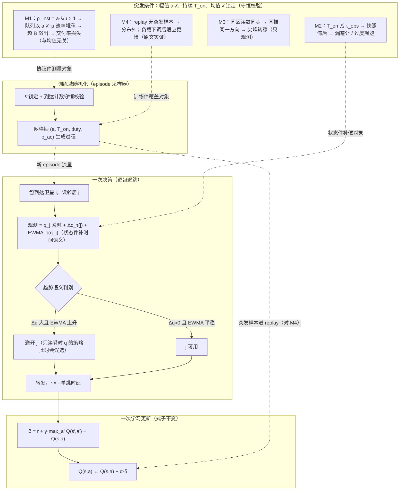

# 主推荐研究文稿（MAIN-RECOMMENDATION，2026-09-11 续作，主控）

> 选题交付物 ③。主线 = **C2「负载过程是训练与评估的共享盲区：同均值突发扫描协议」**（c24abb72218，深化稿 C2-v2，本轮裁决 PASS）。
> 独立备选 = A3（见 §9）。候选比较与退出理由见 VERDICT-3CARDS.md。

## 0. 一段话讲清

**现在最值得研究的**：LEO 强化学习路由在"平均负载相同、突发形状不同"下的行为从未被参数化测量过——**全库 111 篇文献**（两轮关键词扫描 + 约 40 篇上下文行核验）没有一篇做同均值形状参数化，31 篇学习法路由没有一篇把突发族过程放进训练或评估，没有一篇在状态里放突发形状语义特征；甚至发现有仿真器**自带 ON-OFF 突发能力、评估时却主动只用恒定速率**（理由竟是"结果更一致"）。诚实边界：突发建模本身不新（ELB 2009 用过 ON-OFF Pareto 固定形状；2000 年有自相似 vs 泊松对照）——空白精确落在"**RL 时代 + 同均值参数化 + 训练/状态件**"三件套。
**为什么值得做**：排队论标准结果保证"同均值、二阶矩不同 → 时延不同"（M/G/1 的 E[W]=λE[S²]/(2(1−ρ))），瞬时超订期的溢出丢包由突发参数决定、与均值无关——所以这个盲区不是"少测了几个点"，而是可能系统性错估策略在真实负载下的到达率与时延。
**具体怎样改**：三件东西，不动学习算法本身——①协议件：同均值突发扫描（锁死均值，扫幅值×持续×占空比，到达计数守恒校验，瞬态窗条件指标作主判据）；②训练件：域随机化（episode 在过程参数网格上采样）；③状态件：给瞬时队列读数补三个时间语义通道（Δq、EWMA、到达计数）。
**最强反对**：这个差异在真实 LEO 平台上可能一阶不显著——统计复用会把接入侧突发在骨干侧抹平；且若差异存在但域随机化训练全部回收、状态通道无增量，本题的 RL 改进主张降级为评估协议贡献。我们把判死标准预先写死，负结果也有登记路径。

## 1. 重要条件下现有方法为什么做不好

**重要条件**：真实负载是有时序结构的——突发（幅值 a×λ̄、持续 T_on、占空比 duty、自相关 ρ_ac）而均值 λ̄ 不变。这是"负载变化"里最常被绕开的一种变化：多数评估只扫强度（均值），不扫形状。

**核验范围内现有方法的合同事实**（全部逐字核验，定位见 READING-GUIDE）：
- CMNCS52M：队列占用由正态分布**直接采样**（L89），负载模型自述"not time-dependent"、**时间特征被从状态表示中删除**（L177）——没有包级到达过程；
- SaTE：1 秒粒度泊松流生成器（L232），扫描轴只有均值 125–500 flows/s（L292）；
- TQF59BD7（本轮新发现）：仿真器同时具备 ON-OFF 与 CBR 会话，"we focus on the latter for more coherent results"（L371）——**突发能力在工具链中存在，评估时被主动排除**；
- LZKNZA8B：最接近的过程模型是 NHPP+确定性正弦调制（L66）——**时变 ≠ 突发**：平滑调制下增量仍泊松，无 T_on/占空比结构，且训练评估同分布；
- **全库审计（AUDIT-FULL-111，111/111 篇两轮关键词扫描 + 约 40 篇上下文行核验）**：
  - 同均值形状参数化（锁均值扫形状）：**0/111**（任何文献类型）；
  - 突发族过程（ON-OFF/MMPP/自相似/重尾）进入**学习法路由**的训练或评估：**0/31**；
  - 状态含突发形状语义特征：**0/31**（弱时间聚合 2/31：CYMQ2GLA 的 EWMA 速率——其设计意图是**滤掉**短期波动，与本方案相反；LZKNZA8B 的序列网络编码——驱动过程是平滑 NHPP）。
- **诚实边界（全库审计后的必要声明）**：突发建模本身**不是新命题**——前 RL 时代已有（ELB 2009 用 ON-OFF Pareto 流，形状固定 1.2/200ms，L215 逐字；Gragopoulos 2000 自相似 vs 泊松对照，经 TSV3IE8S L309 引用级）；真实网测量也见过突发（Starlink 丢包突发分布，S2QZRBEJ L129–133）。本方案的立论精确落在：**RL 时代 + 同均值参数化 + 训练/状态件**三件套无人做过，而不是"突发"无人想过。

**分界（纪律）**：以上是"没有评估/没有建模"的合同事实；"现有方法在这些条件下**确实**做不好"是待证命题，由 §7 的 M0/M1 直接裁决。本方案不把"没测"当"做不好"的证据，只把它当作机制候选集与立项理由。

## 2. 改动针对什么原因（四条机制链，每条可单独证伪）

设突发源：幅值 a×λ̄、持续 T_on、占空比 duty，均值 λ̄ 锁定；链路服务率 μ，队列容量 B，观测/信令周期 τ_obs：

| 机制 | 内容 | 证据等级 |
|---|---|---|
| **M1 瞬时超订→溢出**（到达率通道） | 突发期 ρ_inst=a·λ̄/μ>1 时队列以 (a·λ̄−μ) 速率堆积，超剩余容量即溢出；**损失由 (a, T_on, B−q₀) 决定，与均值无关**——这是"同均值不同交付率"的机制核；M/G/1 的 E[W]=λE[S²]/(2(1−ρ)) 说明同均值下二阶矩不同则时延不同 | ✅ 理论背书（排队论标准结果） |
| **M2 状态-动作时间错配**（观测通道） | T_on ≲ τ_obs 时策略读到的快照系统性滞后：把"正在恶化"当可用、把"已恢复"当拥塞；退化由 T_on/τ_obs 比值控制，**均值不进入该比值** | ✅ 机制可证伪；在目标平台是否一阶显著【待证】 |
| **M3 同质 herd 振荡** | 同区域卫星读数同步抬升 → 同时把流量推向同一替代方向，尖峰转移而非消除 | ⚠️ 推演；归 C1 轴，本方案只观测不改动 |
| **M4 更新错配**（学习通道） | replay 样本全部来自无突发生成器 → Q 学到"短队列=安全"的平稳关系，突发样本分布外；负载下调后适应更慢有原文实证（Boyan&Littman L73 逐字："when network traffic levels were then lowered again, adaptation was much slower"） | ✅ 有文献实证 |

## 3. 具体怎样改（三个件，学习算法零改动）

**原来的决策/学习过程**：逐包逐跳 DQN 类——包到达卫星 i → 读邻居瞬时队列 q → argmax Q 选下一跳 → r=−单跳时延 → 标准 Bellman 更新。训练 episode 全部来自同一简化生成器。

| 件 | 针对 | 改动 | 一次具体决策/更新的变化 |
|---|---|---|---|
| **协议件** | M1 | 同均值突发扫描：(CBR/ON-OFF) × a∈{1.5,3,6} × T_on∈{0.2,1,10}s × duty∈{0.2,0.5}，λ̄ 锁定；到达计数守恒校验（偏差 >1% 则 run 作废）；**主判据=瞬态窗条件指标**（突发起点后 [0,3T_on] 窗内条件化的交付率/p99 时延），时间平均指标只作参考 | 输出"交付率/时延 vs (a,T_on)"曲面与冻结策略跨过程退化曲线——这是 M1 的直接测量，也是给训练件提供"该混什么"的坐标系 |
| **训练件** | M4 | 域随机化：episode 采样器在过程参数网格抽过程，λ̄ 锁定 | Bellman 更新式**一字不改**；变的只有生成器 |
| **状态件** | M2 | s_i 增加 Δq_τ(j)=q_j(t)−q_j(t−τ)、EWMA_τ(q_j)（半衰期对齐 T_on 网格中值）、到达计数 EWMA | 决策语义从"q 高→避开"变为"q 高但 Δq<0 且 EWMA 平稳→可用；q 中但 Δq 大且 EWMA 上升→规避"——瞬时读数升级为带趋势语义的读数 |

**信息来源与决策时可得性**：三个通道全部是本地计数器的滑窗统计，不新增信令、不新增传感；训练件只改训练期生成器，部署零新需求。
**代价**：状态维度 +3；训练分布变宽 → 收敛步数上升；协议件要求瞬态窗埋点（平台侧工作量，见 §8）。
**失效条件（写死）**：(a) 只看长时间平均且瓶颈为容量守恒——M1 只重排时延分布不改平均交付率（故主判据必须是瞬态窗指标）；(b) 策略反应时标与 τ_obs 均 ≪ T_on——M2 消失；(c) 汇聚统计复用把突发平滑（骨干 ISL 趋近泊松极限）——M1/M3 分不出差异；(d) M1–M4 一阶不显著 → 触发降级条款。

## 4. 机制图

**走通说明**：一次决策——突发中段，邻居 j 瞬时 q=50%（看起来可用），但 Δq_τ=+18%、EWMA 上行 → 趋势判别为"恶化中"，策略避开 j；只读瞬时 q 的同结构策略转入 j 并在该突发窗内吃到溢出。一次学习更新——该决策的 (s,a,r,s′) 进入 replay；由于训练件已把多过程族样本混入，TD 更新不再只反映平稳关系。协议件不负责决策，负责把这一切**测出来**：同均值网格 + 守恒校验 + 瞬态窗指标。

## 5. 成熟简单方法为什么尚未充分解决（条件对齐后逐条）

| 替代 | 覆盖哪些机制 | 为何仍不足 |
|---|---|---|
| 混合负载训练（含突发混训） | M4 | 对 M1–M3 **不提供归因**：混训后差异无法指认是形状还是占用率/容量漂移（CMNCS52M 五变量混淆是现成教训，ERRATA-RUN2-01）；且输出不了"同均值形状曲面"，回答不了"哪个突发参数一阶致命" |
| 在线微调 | M4 部分 | 对 M2 无效——错配在**观测端**（快照滞后），微调改参数不改信息通道；负载下调适应更慢有原文实证（M4），突发时标短于适应时标时来不及 |
| 已有信息（瞬时 q） | M1/M3 的信息"在"网里 | M2 的缺口是**读数缺时间语义**：同均值下"q=50% 上升中"与"q=50% 已过峰"读起来一样（两篇状态定义核验：42E4NAQU L123、CMNCS52M L143 均只含瞬时 q） |
| 规则路由（ECMP/CA-DRP 类） | — | 与逐跳 RL 同源信息盲区；必须进扫描矩阵作对照，不作"已足够"的候选 |

**不能仅凭"规则是固定的"断言其不能适应**：本方案的判据是**实测**——若规则基线在全网格与 RL 无差异，该发现本身即结论的一部分。

## 6. 最近邻差异（四要素，完整版见 C2-v2 §5 与 NEIGHBOR-WAN25F）

1. **LZKNZA8B（2026，库内最近过程模型）**：NHPP+确定性正弦调制是平滑时变，增量仍泊松；训练评估同分布。本方案把**形状**参数化为同均值自变量并冻结扫描——不同对象。
2. **SaTE（2025，评估侧最近邻）**：只扫均值强度；本方案锁均值扫形状，指标换成到达率/时延。
3. **CMNCS52M（2026，反面教材兼近邻）**：负载外生采样/填充 + 协议混改 5 变量；本方案是它的单因素修正案（锁死拓扑/容量/占用/维度）。
4. **42E4NAQU（2026，信息通道最近邻）**：状态=瞬时 q；本方案状态件是其直接升级件。
4b. **CYMQ2GLA（DRL-THSA，全库审计新增）**：状态含 EWMA 平均输入/输出速率——但设计意图是**滤掉**短期波动（"the short-term light traffic load needs to be filtered"，L65–67 逐字）；本方案状态件暴露瞬态趋势，意图相反、粒度不同（相对 T_on 的形状语义 vs 长期平均）。
4c. **JP79GMZS（ELB 2009，前 RL 时代）**：ON-OFF Pareto 突发模型（形状固定 1.2、突发/空闲 200ms，L215 逐字）——证明突发建模不新；但其形状从不作自变量，且非学习法。
5. **Wan25f（arXiv:2507.22174，2025，外部最近邻，摘要级已核）**：通用网络非马尔可夫流量的时空 RL——**无同均值合同、无过程族随机化、非 LEO**，不覆盖本方案；但它已发表"为流量记忆性给 RL 加时间建模"，故本方案的**状态件定位为已知机制向 LEO 的迁移**（迁移条件：星座周期动态、τ_obs 信令约束、逐包逐跳分布式决策），差异锚在**协议件与同均值合同**。论文写作前须取全文核其实验合同（待办登记）。
6. **[Shi03]（2003，非卫星域）**："突发下评估路由"是老命题——本方案贡献不是发现现象，而是把它转成 LEO RL 路由的训练/评估合同并给出可判读协议。

## 7. 验证设计（leo_sim V2；本轮只交付设计，不跑实验）

- **M0（先行步，半天–1 天）**：①审计表 14→19 篇**本轮已完成**（AUDIT-EXT-C2）；②1 个已训策略同均值 CBR vs ON-OFF 冻结对照（复用既有 checkpoint，跨卡复用需主控批准）。
- **M1（1.5–2 天）**：ON-OFF 扫描 + 冻结 vs 每过程重训差值（差值=过程失配可回收部分）；同时检验 M1–M4 特征签名（M1：溢出率随 (a,T_on) 上升而均值不变；M2：误差率随 T_on/τ_obs 下降而上升；M3：方向切换率突增；M4：域随机化后残余差异缩小）。
- **M2（2 天）**：2×2 域随机化 × 状态三通道，分离"覆盖可回收" vs "信息通道可回收"。
- **判读规则（写死）**：同均值同占用下全部格点交付率差 <2% 且 p99 时延差 <5% → 触发淘汰线；任一格超限 → 进入 M1/M2 归因；仅域随机化全回收 → **降级为评估协议卡**（只主张"同均值扫描合同 + 19 篇负载模型审计表"的方法论贡献）。
- **统计纪律**：每格 ≥5 seeds，中位数+IQR；同 seed 跨臂对齐；同均值校验失败即作废（fail-loud）。
- **B3 并入的强度轴扩展**（本轮裁决结果）：把 λ̄ ∈ {0.5, 0.7, 0.9×μ} 的网格与"冻结 vs 重训差值"组合，即得 B3 的"跨体制失标定"测量；阈值显式化（Q 差敏感度分析）作为策略分析仪器附加——**B3 的核心问题由此成为本设计的第二根轴**，不消失。

## 8. 工作量与关键风险

| 项 | 估计 |
|---|---|
| 协议件（生成器 + 守恒校验 + 瞬态窗埋点） | 1.5–2 天平台侧 |
| M0+M1+M2 实验 | 4–5 天（含 5 seeds） |
| 训练件/状态件接入 | 0.5–1 天（不改更新式） |
| 写作 | 与实验并行 |

**关键风险**（按杀伤排序）：
1. **效应一阶不显著**（统计复用抹平 / τ_obs 远小于现实突发时标）→ 降级为协议卡——降级条款已写死，产出仍成立（合同 + 审计表）；
2. **差异存在但域随机化全回收** → RL 改进主张撤销，收窄为训练分布建议；
3. Wan25f 全文核读若意外发现同均值对照 → G5 复审（已登记待办）；
4. N1（实测标定线）若证明真实流量在相关时标近似泊松 → 本方案降级为合同完整性论据（鲁棒性合同仍成立，叙事弱化）。

## 9. 独立备选：A3「塌陷先发生在决策器」（c37b7753f31，与主线实质不同）

**一句话**：主线研究"流量过程的形状"，备选研究"决策器本身的物理容量"——在逐包 DNN 推理 + 有限缓存的合同下，**决策器排队饱和先于链路饱和**，造成一条独立于链路拥塞的到达率损失通道。

- **现象锚（实测，逐字核验）**：S85KQ4FC §III——21k pps 时决策时延 17.5ms、丢包 21%（F=8 推理位、缓存 300 包、i7 实测合同）；该文自身以"推理时延被忽视"为研究动机。
- **改动（对抗检查后收缩为双核）**：①**通道归因奖励**——丢包罚拆 ψ_dec/ψ_lnk，让价值函数能分辨"决策缓存溢出"与"链路溢出"（现有标量奖励在原则上不可辨识，信用分配把决策器饱和误当链路拥塞去绕行）；②**前兆信号**——用决策队列占用 EWMA（领先指标）替代数据路抖动门（滞后指标，且原文自证静态门限跨场景漂移）。滞回/准入/降级地板降级为实现细节。
- **RL 层面困难**（超出工程优化）：决策排队使过程半马尔可夫化（动作生效时延成为状态相关随机变量）；双通道信用分配不可辨；门控引入邻居决策负载的部分可观测。
- **最强反对**：批处理/量化/更强芯片可能把悬崖推出运营区间 → 淘汰线写死（决策时延占比 <5% 即降级为测量+口径卡，双通道记账资产保留）。
- **第一步（半天–2 天）**：单星座 M/D/C/N 决策器模块 + A0/A1 × 强度五点，同出三个判死/放行量：悬崖可复现性、决策时延占比、前兆提前量。
- **数值边界**：21% 为单路由器决策缓存口径，禁写成端到端丢包；悬崖位置绑定 i7 合同，存在性可迁移、数值不可迁移。
- 完整稿：round/run2/drafts/A3-v2.md；对抗检查：round/run3/ADVERSARIAL-A3.md。

## 9b. 边界遵从声明（BOUNDARY-TABLE）

- **锁定的是目标，不是实现**：固定项 = 领域（LEO RL 路由）、RL 实质作用、主指标（到达率/端到端时延）、近期重点（负载变化）、交付形态。路径开放。
- **本方案中的下列设定均为"暂用"工作假设，不是用户要求**：逐包决策粒度、一跳/两跳邻居信息、DDQN 类学习器、28 字段式观测契约、分布式执行与集中训练的解耦方式、星座与失效配置——其中**观测契约与决策粒度恰恰是本方案建议改动的对象**，属"开放实现路径"而非锁定项。
- 若证据要求把改动放到别处（奖励/更新/协作/训练/决策结构），本方案的机制链（M1–M4）允许重新指派改动位置，不需要改题。
- 突破固定项（如把主指标换成开销、或最终方案退化为纯规则）须单列请示。

## 10. 证据与口径声明

- 负载模型审计已覆盖**全库 111/111**（AUDIT-FULL-111：两轮关键词扫描 + 约 40 篇上下文行核验；关键词级"未命中"不等于全文精读排除，承重行均已回原文）。库外声明仍限于已检索范围，不作领域级空白声明。
- 承重引文核验状态：C2 7/7 + A3 锚件与 E4/E5 + B3 三篇 VM 级，全部逐字回原文；LOZANO/WEIL/ZHOU-DTAR 为笔记级（全文不在 VM 集），已如实标注。
- 本方案当前形态 = **协议/机制设计 + 预登记判据**；无实验结果不妨碍提出，但我们不承诺实验必然成功，淘汰线已写死。
